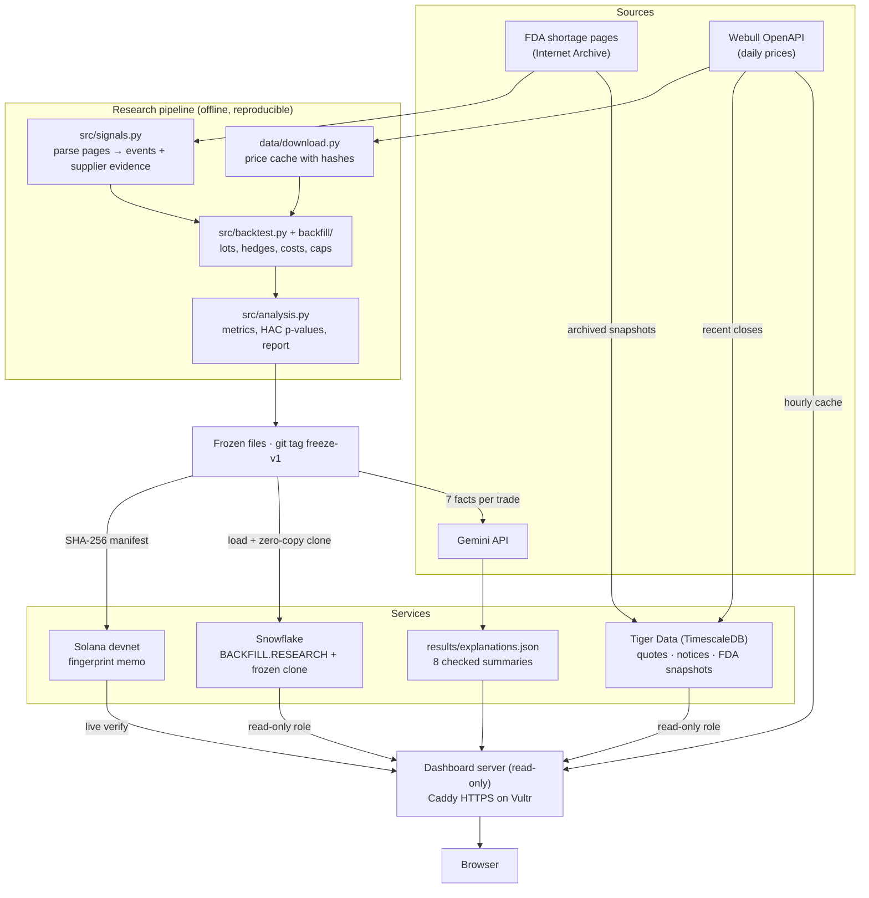

# Backfill

**From FDA drug-shortage notices to auditable supplier-trading research.**

Backfill reconstructs historical FDA shortage notices and supplier availability from Internet
Archive captures, maps each supplier to its listed owner on that date, and tests whether
manufacturers that can still supply a drug outperform a market hedge. Every rule, input and result
is frozen and anchored on Solana, every variant we tried is published, and a live dashboard shows
the evidence.

**Live dashboard:** **https://155-138-224-207.sslip.io** ·
[FDA Time Machine](https://155-138-224-207.sslip.io/time-machine.html) ·
[Five-page research note](output/pdf/backfill_working_candidate_v1.pdf) ·
[Results and limitations](results/research/final_candidate_v1_20261004/RESULTS.md) ·
[Proof of freeze](PROOF.md)

## Contents

- [Hypothesis](#hypothesis)
- [Results](#results)
- [Architecture](#architecture)
- [Technology stack](#technology-stack)
- [Quick start](#quick-start)
- [Repository structure](#repository-structure)
- [Verify the freeze yourself](#verify-the-freeze-yourself)
- [Deployment](#deployment)
- [Security and secrets](#security-and-secrets)
- [Limitations and next steps](#limitations-and-next-steps)

## Hypothesis

When a drug enters shortage, manufacturers that can still supply it may capture demand from
disrupted competitors. Hospitals and group purchasing organizations take weeks to move orders, so
the effect should appear after a delay. Full statement: [HYPOTHESIS.md](HYPOTHESIS.md).

**The rule we test (20/5):**

1. Every FDA-listed presentation for the company on the archived formulation page must be
   available, unallocated and nonempty.
2. Wait until both the shortage observation and the supplier evidence are public, take the next
   US session close, then enter **20 additional sessions later**.
3. Exit **5 sessions after entry**, hedged against SPY with a beta fitted on the 250 prior returns.
   Each event gets 5% of capital; stock costs 10 bp and the hedge 2 bp per side, plus 50 bp/year
   hedge carry.

The 20/5 timing was chosen **after** inspecting in-sample results. It is a research candidate,
not confirmation of the original hypothesis.

## Results

In-sample, June 2014 to September 2024, net of costs.

| Specification | Status | Trades | Sharpe | Sharpe (2x costs) | Total return | Winner p |
|---|---|---:|---:|---:|---:|---:|
| 20/5 candidate, Webull-only prices | chosen after seeing results | 4 | **+0.61** | +0.59 | +1.04% | 0.262 |
| 20/5 candidate, reference prices | chosen after seeing results | 8 | **+0.53** | +0.49 | +1.09% | 0.279 |
| hold120 | registered | 19 | −0.15 | −0.17 | −2.11% | 0.557 |
| all_markets | registered | 35 | −0.19 | −0.22 | −2.47% | 0.569 |
| hold40 | registered | 19 | −0.35 | −0.38 | −2.69% | 0.252 |
| hold20 | registered | 19 | −0.44 | −0.48 | −2.10% | 0.168 |
| allocation | registered | 20 | −0.49 | −0.51 | −5.10% | 0.218 |
| capture60 | registered | 30 | −0.55 | −0.58 | −6.88% | 0.159 |
| certain_dates | registered | 13 | −0.57 | −0.59 | −5.27% | 0.177 |
| primary (registered, hold 60) | registered | 19 | −0.58 | −0.61 | −5.61% | 0.159 |
| all_flags | registered | 22 | −0.66 | −0.69 | −6.43% | 0.114 |

Source: [`results/backtest_report/summary.csv`](results/backtest_report/summary.csv) (the 9
registered variants were rerun on 2026-10-04; the 20/5 rows are the published run).

**What this means:**

- **All 9 pre-registered variants lost money.** The original 60-session hypothesis is not supported.
- The **20/5 candidate is positive** (8 trades, +2.84% average net return per trade), but it rests
  on few trades, **AMRX contributes 87% of the profit** (Sharpe falls to 0.10 without it), and
  **p = 0.28**: not statistically significant. Portfolio return is small because capital is idle
  most of the time (+0.105% a year).
- The 2024–2026 period was already inspected, so it cannot serve as a blind holdout for this rule.
  The next real test is new FDA events after the 2026-10-04 freeze.

Details: [RESULTS.md](results/research/final_candidate_v1_20261004/RESULTS.md) ·
[exact spec](research/final_candidate/SPEC.md) ·
[full audit files](results/research/final_candidate_v1_20261004/20261004T045406Z_8db48a/) ·
[price provenance](data/processed/final_candidate/v1/price_manifest.json)

## Architecture



Each technology answers one question:

| Technology | Question | Role in Backfill |
|---|---|---|
| **Solana** | *When* were the rules fixed? | A memo holding the SHA-256 fingerprint of 10 frozen files, anchored 2026-10-04 08:47:16 UTC |
| **Snowflake** | *What* did we test? | Every variant, the 96 trade cashflows, the price manifest and the proof, plus a frozen zero-copy clone |
| **Tiger Data** | What did FDA say *then*, and what is happening *now*? | 18,218 archived FDA page snapshots (1,042 drugs, 2014–2026), archived notices, recent quotes |
| **Gemini** | Can a non-expert follow a trade? | Two-sentence summaries of the 8 trades, precomputed from 7 facts each and checked |
| **Webull** | Where do prices come from? | Sponsor API for US daily prices in the research and the live chart |
| **Vultr + Caddy** | Where does it run? | Ubuntu server, systemd service, automatic HTTPS |

## Technology stack

### Solana: proof of freeze

We wrote one memo to Solana devnet with the fingerprint of the frozen research files, so anyone can
check they have not changed since **2026-10-04 08:47:16 UTC**.

```
backfill:freeze-v1:9046c956c9f9618af1ab05900b8b078c1ace0d24402cea1f1316834dac264850:9c68c89
```

- `scripts/make_manifest.py`: hashes the 10 files listed in `proof/manifest_files.txt` exactly as
  they are at git tag `freeze-v1` (hypothesis, rule config, spec, price manifest, FDA events, traded
  events, evidence and audit files, published summary).
- `scripts/anchor_solana.py`: sends the memo once with the Solana CLI and saves
  `proof/freeze-v1/receipt.json` ([transaction](https://explorer.solana.com/tx/4hCNYKkhWvrBxXZtShVL3depyb3BmU2WjadXSv1WjpKACKCEsKHxwk2RwzYfEknpMiQsW7oebcgYGk5bRGCqq4Vg?cluster=devnet)).
- `scripts/verify_proof.py`: recomputes the fingerprint from git and compares it with the memo read
  live from devnet. The dashboard's **Verify now** button runs the same check.

It proves the rules existed unchanged at that time. It does not make the earlier backtest
out-of-sample. See [PROOF.md](PROOF.md).

### Snowflake: research audit

`scripts/load_snowflake.py` loads four tables into `BACKFILL.RESEARCH`, then runs
`CREATE OR REPLACE DATABASE BACKFILL_FREEZE_V1 CLONE BACKFILL` and checks row counts match:

| Table | Source | Rows |
|---|---|---:|
| RUNS | `results/backtest_report/summary.csv` | 11 |
| TRADES | the 4 published 20/5 trade files, tagged by vendor policy and cost multiplier | 96 |
| CACHE_MANIFEST | `data/processed/final_candidate/v1/price_manifest.json` (+ raw JSON as VARIANT) | 10 |
| PROOF | `proof/freeze-v1/receipt.json` | 1 |

Every row carries its source file and SHA-256. The dashboard's **Research audit** panel reads RUNS
from Snowflake (cached 10 minutes), labels each variant *registered* or *chosen after seeing
results*, confirms the clone matches, and links the Solana proof. Without Snowflake it falls back
to the CSV and says so.

### Tiger Data: time-series observations

Tiger Cloud (PostgreSQL 18 with TimescaleDB). Tables in `backfill_live` are hypertables, and every
row keeps its **source time** separate from **received_at**, so nothing is read before it was public.

| Table | Contents | Loaded by |
|---|---|---|
| `quotes` | Webull daily closes (FMS, ICUI, SPY) | `dashboard/collect_quotes.py` → `dashboard/ingest.py` |
| `supplier_updates` | 52 archived FDA notices with suppliers and archive links | `dashboard/collect_fda_notices.py` → `dashboard/ingest.py` |
| `fda_snapshots` | 18,218 archived FDA page rows, 1,042 drugs, 2014–2026 | `scripts/load_tiger.py` |

In the dashboard: the **Fresh information** panel (watchlist with an explained *Stale* badge,
markets-closed note on weekends and NYSE holidays, latest archived notices) and the
**FDA Time Machine** page (each drug's status and manufacturers as of any date, plus its timeline).
Archive links match on capture time *and* drug, because one archive second can hold several pages.

### Gemini: trade summaries

`scripts/explain_trades.py` sends only 7 facts per trade (drug, notice date, entry, exit, ticker,
net return, hedge) and stores two-sentence summaries in `results/explanations.json` with the model
name and time. Replies are rejected if they add any number or date, are not two sentences, describe
the stock as short, mention advice or predictions, or use raw field names. The dashboard serves the
cached text (`/api/explain/{trade_id}`) under "AI-generated summary of the facts above" and never
calls Gemini live.

### Webull: prices

`data/download.py` and `backfill/prices.py` fetch US daily bars through the Webull OpenAPI (with a
recorded Yahoo fallback and cross-checks), into a hash-verified cache. The dashboard's specialist
chart (AMPH, AMRX, ANIP, ICUI) uses the same client, cached one hour, and hides itself on failure.

## Quick start

**Requirements:** Python 3.12 and [uv](https://docs.astral.sh/uv/) (or pip with `requirements.txt`).

```bash
git clone https://github.com/AIForge10/BackFill.git && cd BackFill
git fetch --tags                      # freeze-v1 is needed for proof verification
uv sync --all-extras                  # or: pip install -r requirements.txt
cp .env.example .env                  # fill in only the keys you use (see the comments inside)
```

**Reproduce the note with one command:**

```bash
uv run python run_all.py
```

`run_all.py` runs signals → prices (downloaded only if the cache is missing) → backtest → summary.
Price download is the only step that needs the network and Webull keys; without keys, run
`uv run python data/download.py prices --vendor yfinance` first.

**Run the tests** (no keys or network needed; databases, Solana and Gemini are mocked):

```bash
uv run python -m unittest discover -s tests          # 130 tests
```

**Run the dashboard locally** (historical views work without any keys):

```bash
uv run --extra dashboard --extra snowflake python -m dashboard.server   # http://127.0.0.1:8080
```

**Exact reproduction of the 20/5 candidate** needs the frozen licensed price cache at
`data/raw/prices/final_candidate_v1/` (gitignored):

```bash
uv run python -m research.final_candidate.run
```

Missing or altered inputs stop the run; a fresh vendor download is a different data vintage.

## Repository structure

The submission template on the left, our files on the right.

```
BackFill/
├── README.md                  # this file: setup, one command to run, architecture
├── requirements.txt           # pinned, generated from uv.lock (pyproject.toml + uv.lock also included)
├── .env.example               # the one env template; real keys stay in an ignored .env
├── run_all.py                 # one command: reproduces the research note
├── HYPOTHESIS.md              # the hypothesis, predictions and test rules
├── PROOF.md                   # proof of freeze on Solana and how to verify it
├── config.py                  # shared dates, benchmarks and caps
│
├── data/
│   ├── download.py            # download scripts only (prices; raw data is gitignored)
│   ├── company_ticker_map.csv # effective-dated supplier → listed owner mapping
│   └── processed/             # derived FDA tables, events, frozen candidate inputs
├── src/
│   ├── signals.py             # FDA pages → shortage events and supplier evidence
│   ├── backtest.py            # backtest entry point
│   ├── analysis.py            # metrics, inference and summary
│   ├── 01_wayback_index.py … 06_prices.py   # the pipeline steps signals.py runs
│   └── backtest_report.py     # HTML/CSV report across all variants
│
├── backfill/                  # shared accounting engine: events, lots, hedges, costs, guardrails
├── strategies/                # registered primary strategy
├── research/final_candidate/  # the 20/5 candidate: spec, rule config, runner, report
├── results/                   # committed outputs: summary, research run, explanations.json
├── output/pdf/                # the five-page research note
│
├── proof/                     # freeze-v1 file list, manifest and Solana receipt
├── scripts/                   # make_manifest, anchor_solana, verify_proof, render_proof,
│                              # load_snowflake, load_tiger, explain_trades, deploy_vultr.sh
├── dashboard/                 # read-only web dashboard (server, API, Tiger/Snowflake/Solana
│                              # readers, collectors, static UI, FDA Time Machine)
├── tests/                     # 130 unit tests
├── docs/                      # pipeline documentation (BACKFILL.md) and sponsor usage guides
├── examples/ + webull_bt/     # Webull sponsor starter kit (backtrader examples)
└── LICENSE
```

## Verify the freeze yourself

No wallet or keys needed:

```bash
git clone https://github.com/AIForge10/BackFill.git && cd BackFill && git fetch --tags
uv sync && uv run python scripts/verify_proof.py --tag freeze-v1      # prints PASS
```

Or open the live dashboard, go to **Verify**, and press **Verify now**: it shows the fingerprint
recomputed from git next to the memo read from Solana.

## Deployment

The live site runs on a Vultr Ubuntu 22.04 server and does not depend on any laptop:

```bash
scripts/deploy_vultr.sh root@SERVER_IP [ENV_FILE] [DOMAIN]
```

One command uploads the single server `.env`, installs git, uv and Python 3.12, clones `main` with
its tags, installs locked dependencies, runs the dashboard as an unprivileged systemd service on
`127.0.0.1:8080` (auto-restart, starts on boot), puts **Caddy** in front with an automatic Let's
Encrypt certificate (free `sslip.io` name unless a domain is given), opens only ports 22/80/443, and
then checks every feature from the caller's machine. Re-running it redeploys the latest `main`.

## Security and secrets

- **One `.env` per machine, never committed.** The server's holds only read-only database logins
  and Webull keys; the deploy script refuses to upload writer or Gemini credentials.
- **Read-only database logins.** The dashboard uses Tiger role `backfill_reader` (SELECT only) and
  Snowflake user `BACKFILL_DASHBOARD` with role `BACKFILL_READER`. Writes, drops and privilege
  changes were tested and refused.
- **The browser cannot run SQL** or reach Tiger, Snowflake, Gemini or Webull. It calls fixed
  read-only endpoints; database errors are returned without connection details.
- **HTTPS** via Caddy and Let's Encrypt; the app port is not exposed.

## Limitations and next steps

- The 20/5 rule was selected after seeing in-sample results; 8 trades, one company drives most of
  the profit, and it is not statistically significant.
- Execution costs need calibration: indicative AMRX spreads (~89 bp) exceed the modeled 20 bp round trip.
- Solana runs on devnet (free, may be reset; the receipt keeps a copy). Mainnet costs about $0.001.
- Live quotes are daily closes collected on demand; FDA notices are archived snapshots, not a live feed.

**Next:** forward-test new FDA shortage events against the frozen rule, calibrate costs to real
spreads, anchor future freezes on Solana mainnet, and schedule data collection.

## License

[Apache 2.0](LICENSE)
